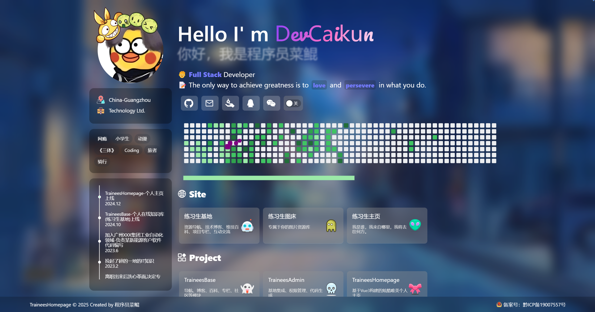
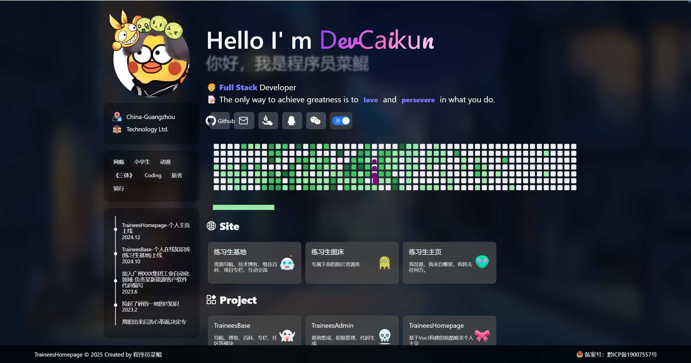

# Vue3 + TypeScript5 + Vite6

This template should help get you started developing with Vue 3 and TypeScript in Vite. The template uses Vue 3 `<script setup>` SFCs, check out the [script setup docs](https://v3.vuejs.org/api/sfc-script-setup.html#sfc-script-setup) to learn more.

Learn more about the recommended Project Setup and IDE Support in the [Vue Docs TypeScript Guide](https://vuejs.org/guide/typescript/overview.html#project-setup).

演示站：https://homepage.trainees.cn

PC截图  
  
  

Mobile截图  
  

感谢 [zyyo] https://github.com/ZYYO666/homepage
